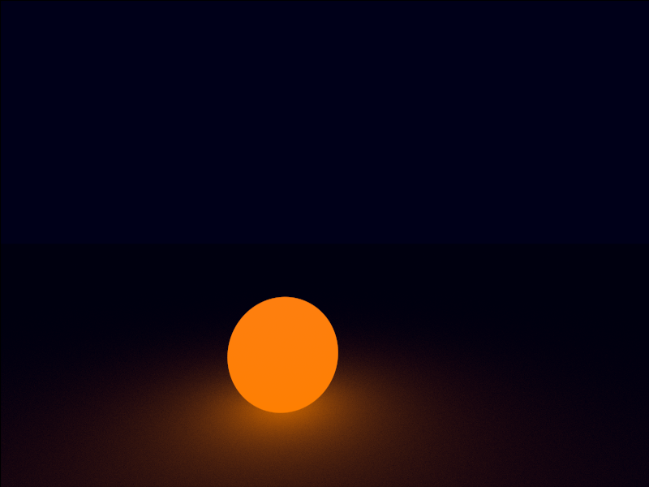
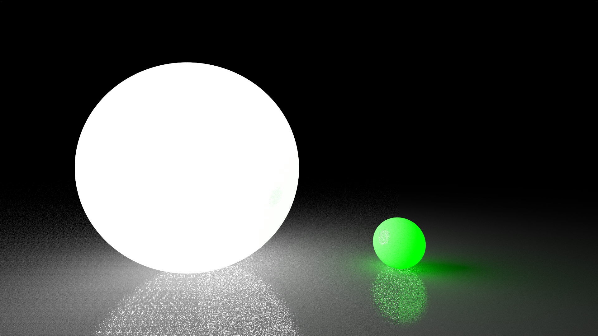
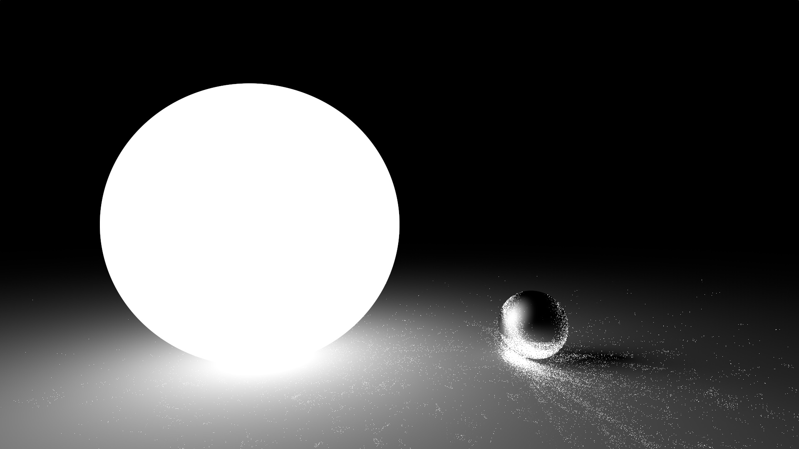

# Python Raytracer
A raytracer, written entirely in Python 3.

---

GLSL-Based interactive variants are available here:

---

- GLSL Raytracer V1
- <a href="https://www.shadertoy.com/view/3tffRN">https://www.shadertoy.com/view/3tffRN</a>

---

- GLSL Raytracer V2
- <a href="https://www.shadertoy.com/view/3t2fzm">https://www.shadertoy.com/view/3t2fzm</a>

---

## Features
- Sphere intersection
- Plane intersection
- TODO: finish this
---

## How to run
TODO: finish this

